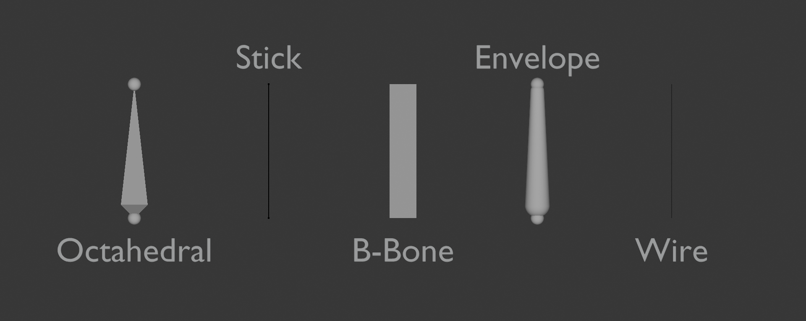
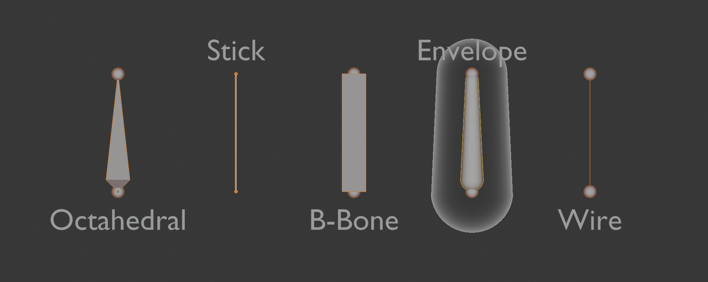

본은 블렌더와 로블록스 스튜디오 에디터와 동일하게 삼각형과 구를 이용해 표시합니다.

어떻게 보일지 결정할 수 있습니다

## Viewport Display

### DisplayAs

기본:

수정:

선택:

블렌더에서 동기화시 Envelope 는 B-Bone 으로 대체됩니다
로블록스에서 Envelope 는 필요없기 때문입니다.

Custom-Shape 는 MeshPart 혹은 WireHandleAdornment 로 구현됩니다
