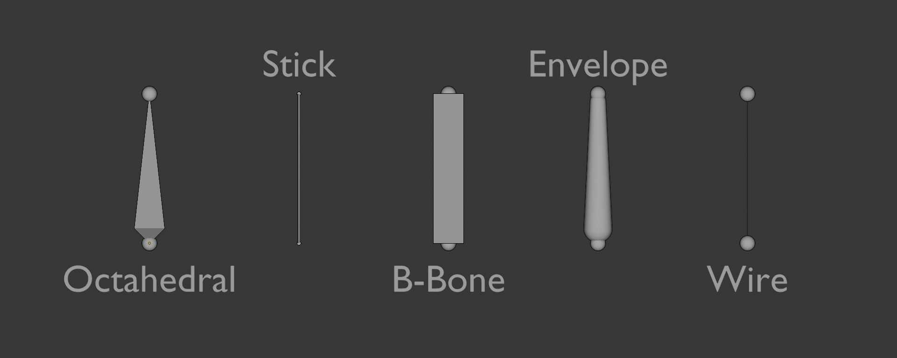

본 시각화는 플러그인 내부 가상 primitive 데이터로 생성합니다.
뷰포트 표시용 임시 렌더 객체는 허용하지만, 저장/동기화 대상 `Instance`로 사용하지 않습니다.

## Viewport Display

### DisplayAs

기본값 동기화 시 Blender의 `Display As` 속성으로 덮어씌웁니다.

기본:
리그를 가만히 두고 있을 때

수정:
리그 수정을 활성화했을 때

선택:
리그 수정을 활성화하고 본을 선택했을 때

Blender에서 동기화 시 `Envelope`는 `B-Bone`으로 대체됩니다.
Roblox 워크플로우에서는 `Envelope`를 별도 타입으로 유지하지 않습니다.

### Primitive Mapping

`DisplayAs` 값은 다음 가상 primitive 조합으로 매핑합니다.

#### Octahedral

- `Cone` 1개 + `Sphere` 2개
- 구 크기는 본 길이 기준 비율로 계산합니다.

#### Stick

- `Line` 1개 + `Sphere` 2개

#### B-Bone

- `Box` 또는 `Mesh` 기반 본체 primitive

#### Wire

- 기본은 `Line` 중심 표시
- 선택 상태에서는 끝점 강조 primitive를 추가할 수 있습니다.

### CustomShape

`CustomShape`는 `AdapterVisualPrimitive`의 `PrimitiveType = "Mesh"`로 표현합니다.
`MeshPart` 같은 저장형 인스턴스를 직접 데이터 모델에 두지 않습니다.

### BoneColors

- `normal`
- `on-edit`
- `selected`

세 상태 색상을 설정할 수 있습니다.
값이 비어 있으면 Blender 동기화 색상을 사용합니다.
